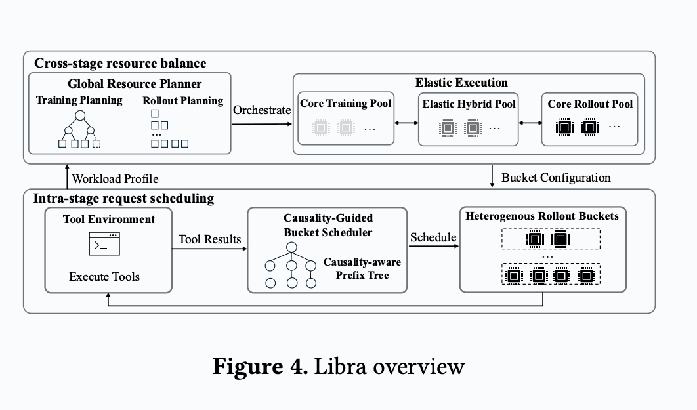

<h1 align="center">Libra</h1>

<h3 align="center">Efficient Resource Management for Agentic RL Post-Training</h3>

<p align="center">
  A resource-aware systems framework for disaggregated, asynchronous
  post-training of agentic language models.
</p>

<p align="center">
  <a href="#documentation">
    
  </a>
  <a href="https://arxiv.org/abs/2606.03077">
    
  </a>
  <a href="./LICENSE">
    
  </a>
  <a href="https://github.com/NetX-lab/Libra/stargazers">
    
  </a>
</p>

<p align="center">
  <a href="#latest-news">Latest News</a> ·
  <a href="#features">Features</a> ·
  <a href="#system-overview">Architecture</a> ·
  <a href="#installation">Installation</a> ·
  <a href="docs/manual.md">Manual</a> ·
  <a href="#citation">Citation</a>
</p>

Libra coordinates training and rollout clusters, routes requests across
heterogeneous vLLM workers, and adapts resource allocation as workload pressure
changes during training.

This repository accompanies the paper **"Libra: Efficient Resource Management
for Agentic RL Post-Training"**. Read the [paper](https://arxiv.org/abs/2606.03077) for the full design.

> This is the **Ascend NPU implementation branch**. The NVIDIA GPU release is
> maintained separately on [`main`](https://github.com/NetX-lab/Libra/tree/main).

## Latest News

- **2026-08-06** — Added multi-node Ascend NPU cluster support, including
  Megatron-Core/HCCL training, vLLM Ascend rollout workers, Global Resource
  Planner integration, C-MLFQ scheduling, and Elastic Hybrid Pool execution.
  The reference validation uses Qwen3-14B on 6 nodes and 48 NPUs.
- **2026-08-03** — Libra was officially open sourced.


## System Overview



Libra splits RL post-training into a core training pool, a core rollout pool,
and an elastic hybrid pool. The Global Resource Planner chooses how many GPUs
belong to training and rollout, then selects the training parallelism and the
heterogeneous rollout TP buckets. The C-MLFQ scheduler routes rollout requests
through the core rollout pool according to causality-aware trajectory state.
Elastic execution applies planner decisions by moving capacity between the
training and rollout sides while keeping the core training process group stable.

## Repository Layout

```text
RL_Framework/
├── config.py                         # Dataclass configuration loader
├── trainer/async_rl_trainer.py       # Asynchronous GRPO training loop
├── engine/                           # vLLM, FSDP, and Megatron adapters
├── infra/
│   ├── cost_model/                   # Cost evaluator and global planner
│   ├── elastic/                      # Hybrid pool, runtime executor, IPC
│   ├── execution/                    # Async runner and batch dispatcher
│   ├── observability/                # Runtime history collection
│   ├── scheduling/                   # C-MLFQ and baseline schedulers
│   └── sync/                         # Staleness and weight synchronization
├── workflow/                         # Agentic workload implementations
├── env/                              # Tools, prompts, graders, and rewards
├── configs/                          # Hardware, model, and experiment configs
├── examples/                         # Training entrypoints and validation examples
├── scripts/                          # Local and Slurm launchers
├── data/                             # Dataset preparation utilities
└── tests/                            # Unit and integration tests
```


## Features

- **Global Resource Planner (GRP).** Searches training and rollout allocations
  under a fixed GPU budget, including training TP/PP/DP choices and rollout TP
  bucket layouts.
- **Online dynamic replanning.** Periodically consumes runtime history and queue
  pressure, evaluates candidate allocations, and applies a new plan only when
  the expected benefit exceeds the configured transition cost.
- **C-MLFQ scheduler.** Maintains a causality-aware prefix tree from completed
  trajectories and routes new or resumed rollout requests to TP buckets based on
  observed tool-return state and remaining work.
- **Heterogeneous rollout cluster.** Runs multiple OpenAI-compatible vLLM
  instances with different tensor-parallel degrees, such as TP-1, TP-2, TP-4,
  and TP-8 buckets.
- **Elastic Hybrid Pool.** Models workers that can move between rollout and
  training roles without changing the fixed core training topology.
- **Decoupled communication domains.** Keeps core training collectives separate
  from elastic hybrid-worker gradient exchange, so dynamic training-side
  changes do not perturb Megatron-Core or FSDP process groups.
- **Cluster-swap execution.** Supports no-spare-GPU resource exchange between
  rollout and training pools when the planner changes the allocation.
- **Megatron-Core training backend.** Supports tensor parallelism, distributed
  optimizer, sharded checkpoint metadata, precision-aware optimizer settings,
  and CPU optimizer offload for large models.
- **Ascend NPU runtime.** Supports torch-npu device selection, HCCL distributed
  execution, Megatron-Core compatibility shims, and vLLM Ascend rollout pools.
- **Async GRPO pipeline.** Decouples rollout and training, tracks policy
  versions, bounds off-policyness, and can recompute log probabilities before
  policy updates.
- **Agentic workloads.** Includes workflows and rewards for R2E-Gym,
  Search-R1, DAPO-Math-17K, GSM8K, and code-agent style experiments.
- **Observability.** Records history, runtime planner decisions, throughput,
  rewards, C-MLFQ prefix trees, rollout manifests, and reconfiguration events.

## Documentation

| Guide | What it covers |
| --- | --- |
| [Cluster manual](docs/manual.md) | End-to-end configuration and launch workflow |
| [Data preparation](docs/data_preparation.md) | R2E-Gym, Search-R1, and DAPO-Math datasets |
| [Configuration reference](docs/configuration_reference.md) | Core, Megatron-Core, planner, and elastic options |
| [Observability](docs/observability.md) | Logs, manifests, planner decisions, and runtime history |
| [Environment setup](docs/env_creation.md) | Base software environment and dependencies |
| [Compute-node setup](docs/env_creation_compute_node.md) | Environment preparation on cluster compute nodes |
| [Multi-node Slurm guide](docs/slurm_multi_node_guide.md) | Distributed launch configuration and operational notes |
| [Megatron-Core backend](docs/megatron_core_backend.md) | Backend architecture, configuration, and stability guidance |
| [Runtime history collection](docs/history_data_collection.md) | Metrics and history data used by the online planner |
| [NPU support overview](docs/npu_support.md) | NPU branch scope, architecture, and supported components |
| [NPU cluster quick start](docs/npu_cluster_quick_start.md) | Six-node launch preparation and reusable environment setup |
| [Validated Ascend environment](docs/ascend_megatron_validated_environment.md) | Reproducible Megatron-Core/Bridge and vLLM Ascend dependency baseline |
| [NPU validation report](docs/npu_validation.md) | Qwen3-14B, 6-node/48-NPU, 100-step validation evidence |

> Libra is a research artifact. This branch targets multi-node Ascend NPU
> clusters. Host addresses, network devices, shared paths, and model locations
> in the reference templates must be adapted to your environment.

## Installation

```bash
python3 -m venv .venv
source .venv/bin/activate
python -m pip install --upgrade pip setuptools wheel
python -m pip install -r requirements.txt

# Libra is imported as RL_Framework from the parent directory.
export PYTHONPATH="$(dirname "$PWD"):${PYTHONPATH:-}"
```

For Ascend NPU hosts, use the NPU dependency split instead:

```bash
bash scripts/setup_npu_env.sh
```

See the [NPU cluster quick start](docs/npu_cluster_quick_start.md) and
[validated Ascend environment](docs/ascend_megatron_validated_environment.md)
for the CANN, Megatron-Core/Bridge, and vLLM Ascend dependency paths.

If your platform has a compatible vLLM wheel, you can simplify installation by
using that wheel instead of a source build. On clusters, install inside the same
environment that Slurm jobs will activate.

## Testing

Run CPU-friendly tests first:

```bash
pytest -q \
  tests/test_cmlfq_scheduler.py \
  tests/test_preflight_planner.py \
  tests/test_global_resource_planner_simulators.py \
  tests/test_grpo_grouping.py \
  tests/test_runtime_elastic_executor.py
```

NPU, distributed, HCCL, and end-to-end tests are environment dependent. Start
with `examples/test_megatron_core_npu_runtime.py`, then use the cluster launcher
under `scripts/` for the full reference topology.


## Citation

If Libra is useful in your research, please cite:

```bibtex
@misc{chen2026libraefficientresourcemanagement,
      title={Libra: Efficient Resource Management for Agentic RL Post-Training},
      author={Kaiwen Chen and Xin Tan and Jingzong Li and Hong Xu},
      year={2026},
      eprint={2606.03077},
      archivePrefix={arXiv},
      primaryClass={cs.LG},
      url={https://arxiv.org/abs/2606.03077},
}
```

## Acknowledgements

Libra builds on ideas and components from the broader open-source RL and
distributed-systems ecosystem, including verl, vLLM, Megatron-LM, AReaL, Sailor,
and Vidur. Please cite the corresponding projects when using those components.

## License

Libra is released under the [MIT License](LICENSE).
